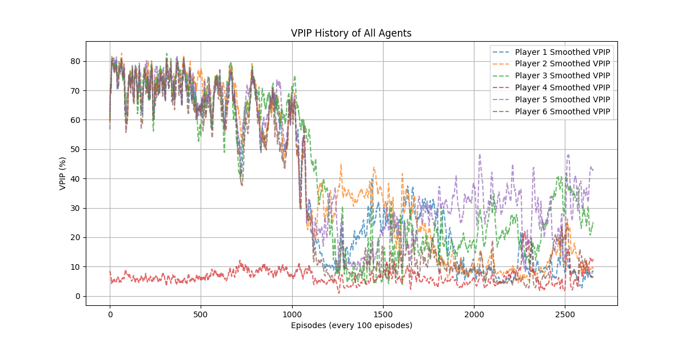

# Poker Reinforcement Learning

A ML project focused on developing  AI agents for playing poker, with primary emphasis on Texas Hold'em.

## Project Description

This project explores the application of RL algorithms to develop strategic poker-playing agents. The system trains AI players that learn optimal poker strategies through self-play and by competing against different opponent types.

The project addresses the complex challenge of decision-making under uncertainty, where agents must learn to:

* Evaluate hand strength across different game stages
* Adapt to opponent strategies
* Make optimal betting decisions based on incomplete information
* Balance exploitative and unexploitable play

The AI agents employ reinforcement learning algorithms including Deep Q-Networks (DQN) and Neural Fictitious Self Play (NFSP) to discover effective poker strategies through extensive training.


## VPIP of DQN Agents in a 6-max 100BB Cash Game



## Expected Value for your hand


## Installation Instructions

### Prerequisites

* Python 3.11
* CUDA-compatible GPU (recommended for faster training)

### Setup

```bash
git clone https://github.com/TrevorPoon/Poker-Reinforcement-Learning.git
cd Poker-Reinforcement-Learning
mkdir -p models result/runs result/log images
```

## Usage Guide

### Training an Agent

```bash
# Basic training with default parameters (DQN vs DQN)
python src/training.py  

# Training a DQN agent against honest players for 50,000 episodes
python src/training.py --scenario DQN_vs_Honest --episodes 50000  

# Training an NFSP agent with specific game parameters
python src/training.py --scenario NFSP_vs_AllCall --initial-stack 100 --small-blind 0.5 --max-rounds 36
```

### Monitoring Training Progress

```bash
tensorboard --logdir=result/runs
```

This provides visualizations of training metrics including:

* Reward progression
* Model loss
* Poker statistics (VPIP, PFR, 3-Bet)
* Hand reward heatmaps


## Configuration

### training.py arguments:

| Argument        | Description                                  | Default      |
| --------------- | -------------------------------------------- | ------------ |
| --episodes      | Number of training episodes                  | 10,000,000   |
| --log-interval  | Frequency of logging metrics                 | 100          |
| --scenario      | Training scenario                            | DQN\_vs\_DQN |
| --training      | Enable training mode                         | True         |
| --agents        | Number of agents (auto-set if not specified) | None         |
| --max-rounds    | Maximum rounds per poker game                | 36           |
| --initial-stack | Initial chip stack                           | 100          |
| --small-blind   | Small blind amount                           | 0.5          |
| --plot-interval | Frequency of generating visualizations       | 1000         |
| --gc-interval   | Garbage collection frequency                 | 10000        |

### Available Scenarios

* `DQN_vs_Honest`: DQN agent vs rule-based players
* `DQN_vs_AllCall`: DQN agent vs players who always call
* `DQN_vs_DQN`: Multiple DQN agents playing against each other
* `NFSP_vs_Honest`: NFSP agent vs rule-based players
* `NFSP_vs_AllCall`: NFSP agent vs players who always call
* `NFSP_vs_NFSP`: Multiple NFSP agents playing against each other
* `NFSP_vs_DQN`: NFSP agents vs DQN agents

## Training Details

### Training Loop

The training loop:

* Initializes agents
* Sets up game environment
* Runs self-play poker episodes
* Collects experience
* Periodically updates models and logs metrics
* Generates plots and heatmaps

### Metric Tracking

Metrics logged include:

* **VPIP**: Voluntarily Put Money In Pot
* **PFR**: Pre-Flop Raise rate
* **3-Bet**: Re-raise frequency
* **Model Loss**: Neural network training loss
* **Reward**: Accumulated chips won

### Visualization

Generated charts include:

* **Action Proportions**: Frequency of each action per street
* **Hand Reward Heatmaps**: EV of each starting hand
* **GTO-Style Action Grids**: Frequency of action choices by hand/street

## Model Architecture

### Deep Q-Network (DQN)

* **Input**: 46-dim vector (cards, pot, stacks, betting history)
* **Network**:

  * Input layer (46)
  * Hidden layer 1 (128, ReLU)
  * Hidden layer 2 (128, ReLU)
  * Hidden layer 3 (64, ReLU)
  * Output layer (11 actions)

### Neural Fictitious Self-Play (NFSP)

* Combines Q-network (reinforcement learning) and policy network (supervised learning)
* Trains toward Nash-equilibrium style play in multi-agent settings

### Exploration Strategy

* Epsilon-greedy:

  * Initial epsilon: 0.2
  * Final epsilon: 0.001
  * Decay: 0.9

## License and Attribution

This project is licensed under the MIT License. See `LICENSE` for more.

Special thanks to **PyPokerEngine** for providing the poker simulation framework.

## Authors

* **Trevor Poon** – Initial work

---


