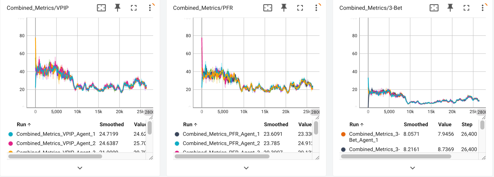
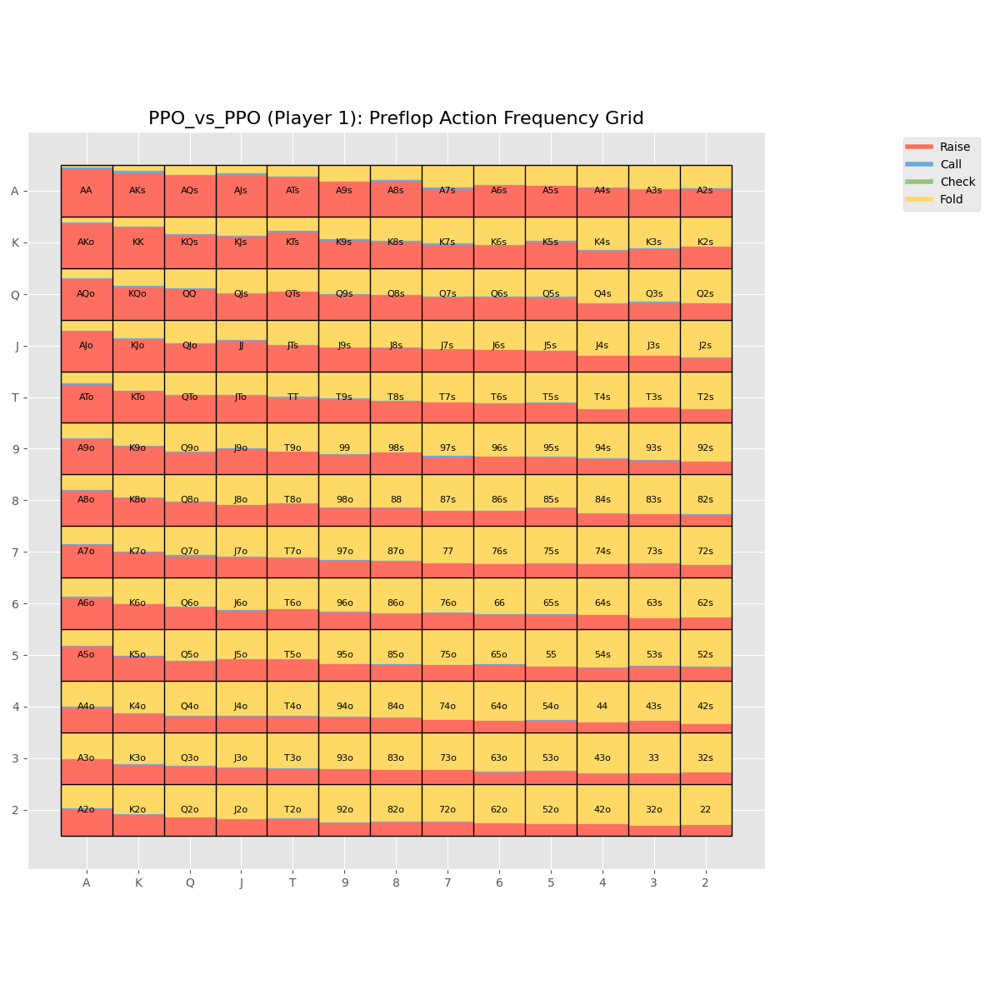
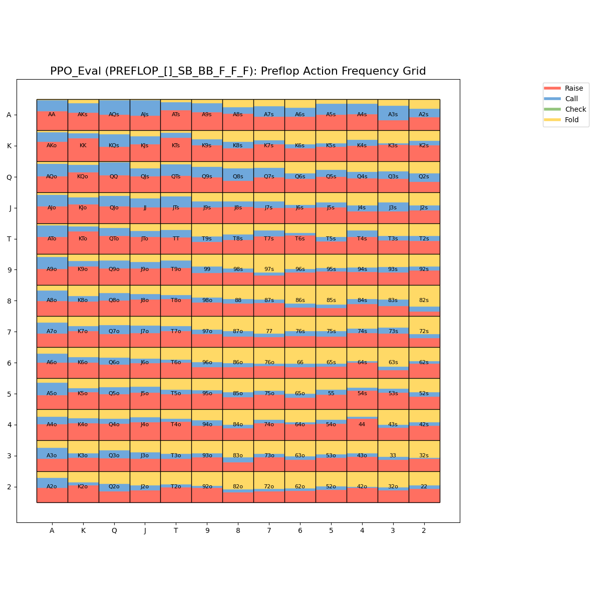

# Poker Reinforcement Learning

A ML project focused on developing AI agents for playing poker, with primary emphasis on Texas Hold'em.

## 1. Project Description

This project explores the application of RL algorithms to develop strategic poker-playing agents. The system trains AI players that learn optimal poker strategies through self-play and by competing against different opponent types.

The project addresses the complex challenge of decision-making under uncertainty, where agents must learn to:

* Evaluate hand strength across different game stages
* Adapt to opponent strategies
* Make optimal betting decisions based on incomplete information
* Balance exploitative and unexploitable play

The AI agents employ reinforcement learning algorithms including PPO to discover effective poker strategies through extensive training.

## 2. Poker Statistics

###  PPO Agents in a 6-max 100BB Cash Game



### Action Tendency of the trained PPO agent in the Preflop Street with 10,000 Training Episodes



### Action Tendency of the trained PPO agent in the Preflop Street with 100,000 Training Episodes



## 3. Addressed Questions

### Why PPO is a better choice than NFSP and DQN?

#### Stability and Sample Efficiency (vs DQN)
DQN is an off-policy method relying on value function approximation, which becomes unstable in multi-agent poker due to non-stationary dynamics (each opponent's strategy evolves over time).

PPO is an on-policy policy gradient method with clipping, which stabilizes updates by limiting how much the policy can change per iteration. This is particularly important in poker where small shifts in policy can lead to drastic downstream effects (e.g., bluffing ranges changing).

#### Credit Assignment and Temporal Dependency (vs NFSP)

NFSP mixes best-response learning (Q-learning) and supervised learning to mimic average policy. While elegant, its reliance on experience replay and dual-memory structure can delay adaptation to changing strategies.

PPO with LSTM explicitly models temporal dependencies via recurrent networks. This allows PPO agents to learn how earlier actions influence later states (important in poker across betting rounds).

### Why sharing parameters across agents helps reach Nash Equilibrium? 

#### Shared Policy = Faster Convergence to Stationary Strategy
In self-play, a Nash equilibrium is reached when all agents’ strategies are best responses to each other. Sharing parameters forces all agents to explore and update a single shared policy. This promotes mutual adaptation, rather than separate overfitting.

#### Reduces Non-Stationarity
Multi-agent learning suffers from non-stationary environments—as each agent learns, the environment changes for others. Sharing parameters synchronizes their updates, making the environment more stable and promoting convergence.

#### Encourages Symmetric Play
In poker, especially 6-max, players should ideally adopt a symmetric equilibrium strategy (e.g., same preflop ranges from same positions). Shared models inherently enforce symmetry, accelerating convergence to equilibrium-like behavior.


## 4. Installation Instructions

### Prerequisites

* Python 3.11
* CUDA-compatible GPU (recommended for faster training)

### Setup

```bash
git clone https://github.com/TrevorPoon/Poker-Reinforcement-Learning.git
cd Poker-Reinforcement-Learning
mkdir -p models result/runs result/log images
```

## Usage Guide

### Training an Agent

```bash
# Basic training with default parameters (PPO vs PPO)
python src/training.py  

# Training a PPO agent against honest players for 50,000 episodes
python src/training.py --scenario PPO_vs_Honest --episodes 50000  

# Training an NFSP agent with specific game parameters
python src/training.py --scenario NFSP_vs_AllCall --initial-stack 100 --small-blind 0.5 --max-rounds 36
```

### Monitoring Training Progress

```bash
tensorboard --logdir=result/runs
```

This provides visualizations of training metrics including:

* Reward progression
* Model loss
* Poker statistics (VPIP, PFR, 3-Bet)
* Hand reward heatmaps


## 5. Configuration

### training.py arguments:

| Argument        | Description                                  | Default      |
| --------------- | -------------------------------------------- | ------------ |
| --episodes      | Number of training episodes                  | 10,000,000   |
| --log-interval  | Frequency of logging metrics                 | 100          |
| --scenario      | Training scenario                            | PPO\_vs\_PPO |
| --training      | Enable training mode                         | True         |
| --agents        | Number of agents (auto-set if not specified) | None         |
| --max-rounds    | Maximum rounds per poker game                | 36           |
| --initial-stack | Initial chip stack                           | 100          |
| --small-blind   | Small blind amount                           | 0.5          |
| --plot-interval | Frequency of generating visualizations       | 1000         |
| --gc-interval   | Garbage collection frequency                 | 10000        |


## 6. Attribution

Special thanks to **PyPokerEngine** for providing the poker simulation framework.


---


